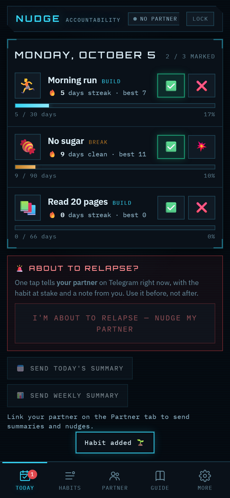
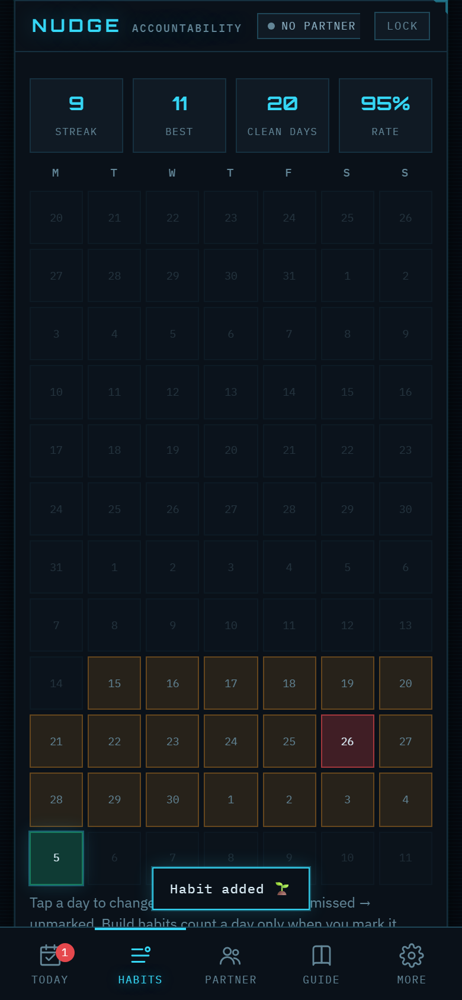
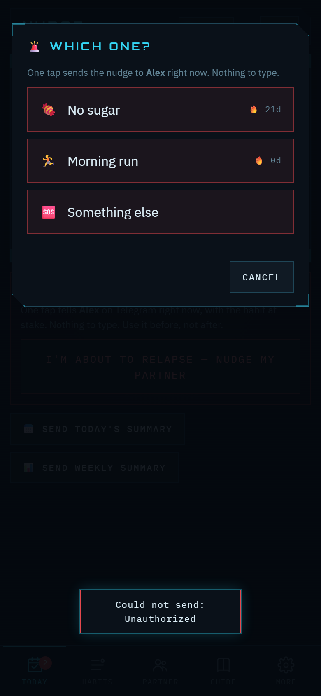
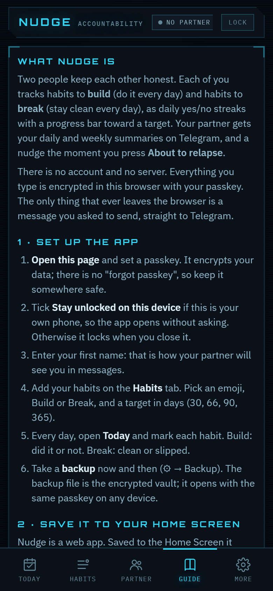
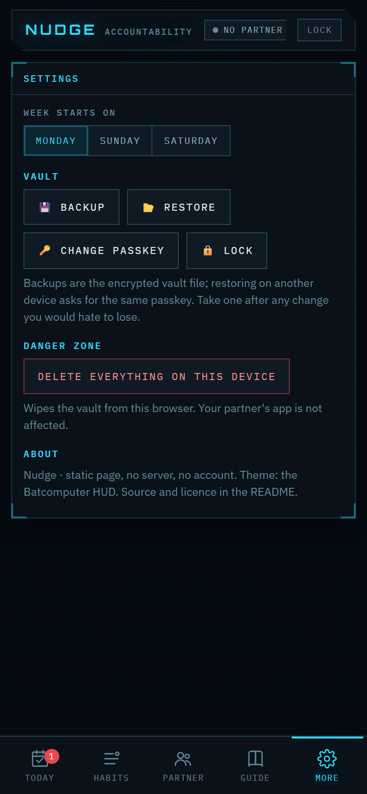
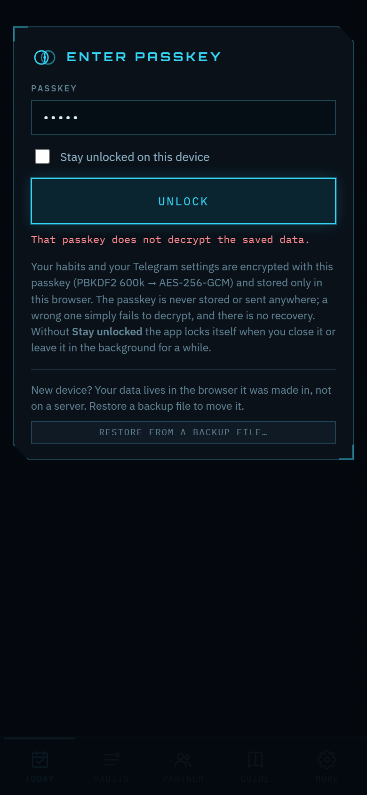
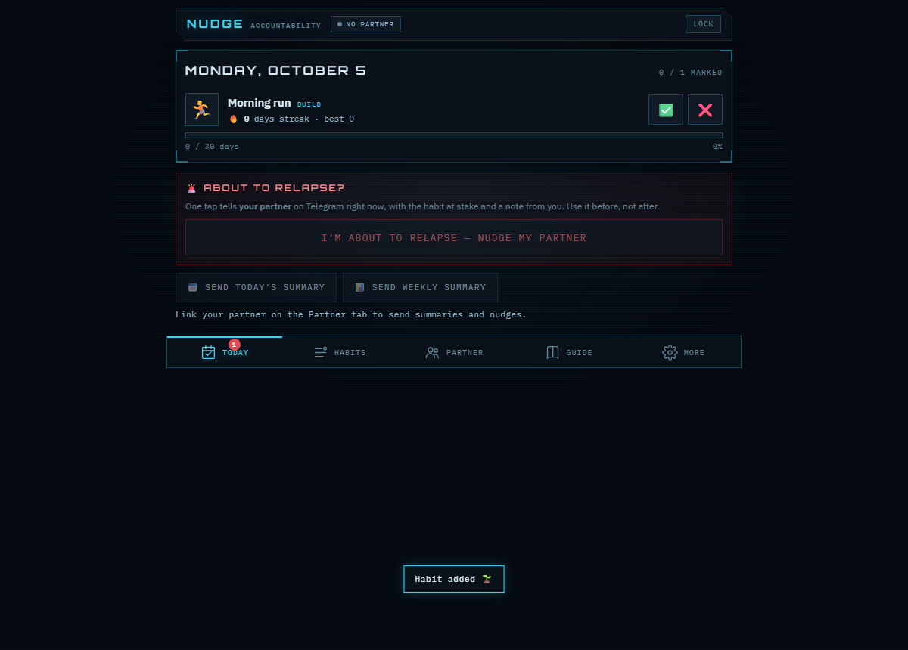

# Nudge

Two-person accountability. Each of you tracks habits to **build** (do it every day) and habits
to **break** (stay clean every day) as daily yes/no streaks with a progress bar toward a target.
Your partner gets your daily and weekly summaries on Telegram, and a nudge the moment you press
**About to relapse**.

No server, no account. Everything you type is encrypted in your own browser with a passkey; the
page is static and holds nothing of yours. The only thing that ever leaves the browser is a
message you asked to send, straight from the browser to Telegram's Bot API.

**Open it:** https://offport.github.io/Nudge/ (then save it to your Home Screen; the Guide tab
shows how).

## Screenshots

Captured in headless Chromium with a throwaway vault and made-up habits; the Telegram token shown
in the test run is fake, and Telegram answered it with "Unauthorized", which is what the app shows.

## How it works

- **Habits.** Build or Break, an emoji, a target in days (21 / 30 / 66 / 90 / 365 or your own), a
  start date, and an optional "why" you will read on a hard day. Add, edit, delete at will. The
  two of you do not need the same habits; each app is its own.
- **Daily check-in.** On Today, each habit gets ✅ or ❌ (Build: did it / not today) or ✅ / 💥
  (Break: clean / slipped). Tap again to clear. The streak, best streak, and a progress bar
  (streak / target) update as you go.
- **Streak rules.** A Build habit counts a day only when you mark it done, and today stays open
  until you mark it. A Break habit counts a day clean unless you mark a slip. A miss or a slip
  resets the streak. The 12-week calendar in each habit lets you correct past days.
- **Telegram.** Each person creates their own bot with @BotFather and pastes the token into their
  own app. Your partner presses Start on your bot; **Find my partner** lists who has messaged the
  bot and you pick them; **Send a test** confirms delivery. Your app then sends, through your bot,
  to your partner's Telegram:
  - a **daily summary** once every habit is marked (automatic, or the button),
  - a **weekly summary** on your first visit in a new week (automatic, or the button),
  - a **relapse nudge** the moment you press the red button, with the habit at stake and its
    streak. Nothing to type: one habit sends on the spot, several means one tap on the one at stake.
  Tokens are never shared and nothing passes through a third server. You keep talking in your
  normal Telegram chat; the bots only deliver notifications. Both directions work the same way
  with the partner's own bot.
- **Lock.** Set a passkey on first visit. Tick **Stay unlocked on this device** on your own phone
  and the app opens without asking (the derived key, never the passkey, is kept as a
  non-extractable key in the browser). Otherwise the app locks when you close it or leave it in
  the background for five minutes, and **Lock** forgets the key at any time.
- **Backup.** The backup file is the encrypted vault; restore it on another device and unlock it
  with the same passkey. Clearing the browser's site data erases the vault, so take backups.

## Privacy model

- The vault is one AES-256-GCM blob in localStorage. The key is derived from your passkey with
  PBKDF2-HMAC-SHA256 (600,000 iterations, random salt) and never stored; a wrong passkey fails to
  decrypt. There is no recovery.
- The repository and the published page contain no user data and no secrets. Hosting on GitHub
  Pages serves exactly the files in this repo.
- Telegram sees the messages you send and nothing else. Calls go from your browser to
  `api.telegram.org` over HTTPS with your own bot's token; the Sent log on the Partner tab records
  each attempt and any error text Telegram returned.

## Running it yourself

It is a single `index.html` plus a manifest, a service worker (offline app shell) and icons. Open
the file, serve the folder statically, or fork the repo and turn on GitHub Pages. The service
worker registers only over HTTPS.

## Credits and licence

Code: MIT. Theme: the Batcomputer HUD. The vault pattern comes from Kryptonite Profile. Fonts from
Google Fonts (IBM Plex, Orbitron); the page still renders in system fonts offline.
