# Nudge

Two-person accountability. Each of you tracks habits to **build** (do it every day) and habits
to **break** (stay clean every day) as daily yes/no streaks with a progress bar toward a target.
Your partner gets your daily and weekly summaries on Telegram, and a nudge the moment you press
**About to relapse**.

No server, no account. Everything you type is encrypted in your own browser with a passkey; the
page is static and holds nothing of yours. The only thing that ever leaves the browser is a
message you asked to send, straight from the browser to Telegram's Bot API.

**Open it:** https://offport.github.io/Nudge/ (then save it to your Home Screen; the Guide tab
shows how).

## Screenshots

<table>
<tr><td width="50%" valign="top">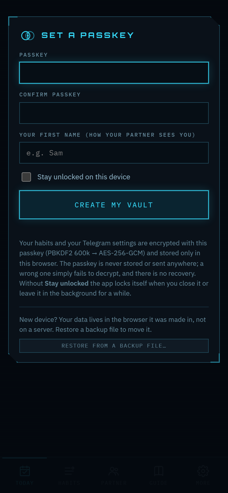 First visit: set a passkey and your first name; the vault is created in this browser.</td><td width="50%" valign="top">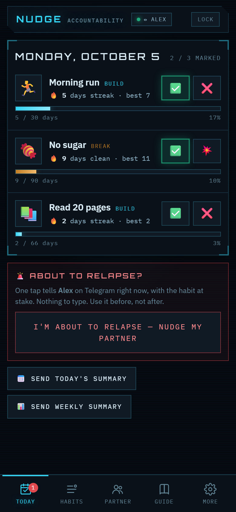 Today: one tap per habit (did it / not today, clean / slipped), streak and best, progress bar to the target, and the red relapse button.</td></tr>
<tr><td width="50%" valign="top">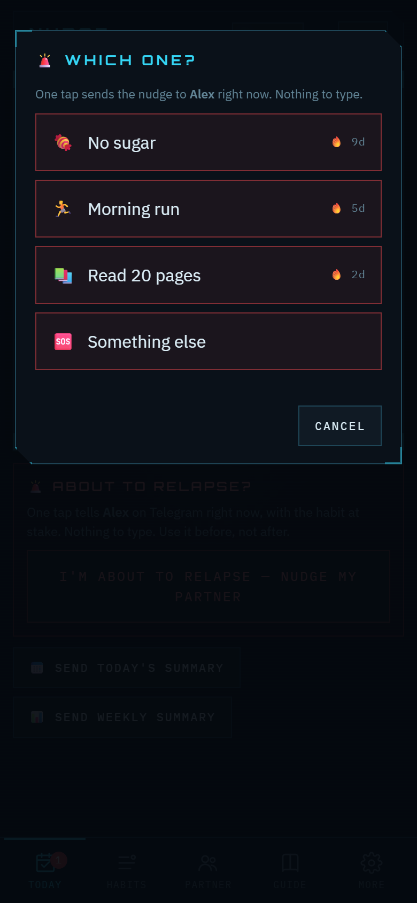 About to relapse: with several habits, one tap on the one at stake sends the nudge. Nothing to type.</td><td width="50%" valign="top">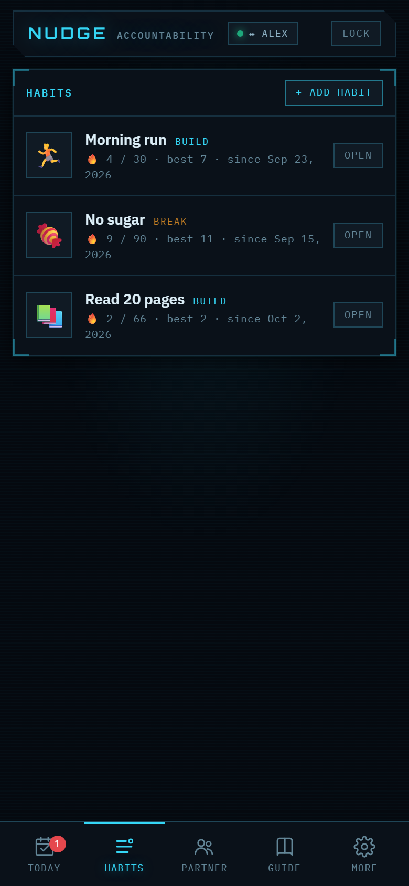 Habits: Build or Break, emoji, target in days, since when; open one to see its history.</td></tr>
<tr><td width="50%" valign="top">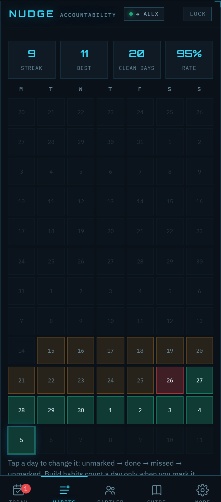 A habit's history: streak, best, days clean, success rate, and 12 weeks you can tap to correct.</td><td width="50%" valign="top">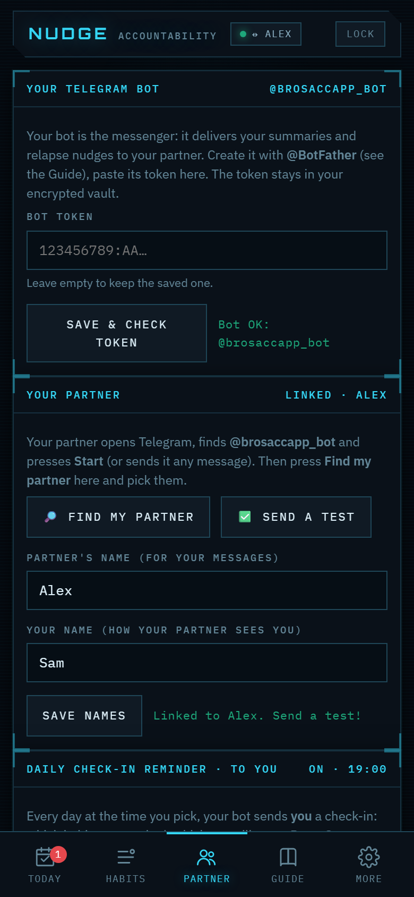 Partner: your own bot (checked against Telegram), find your partner among the chats that started it, test it.</td></tr>
<tr><td width="50%" valign="top">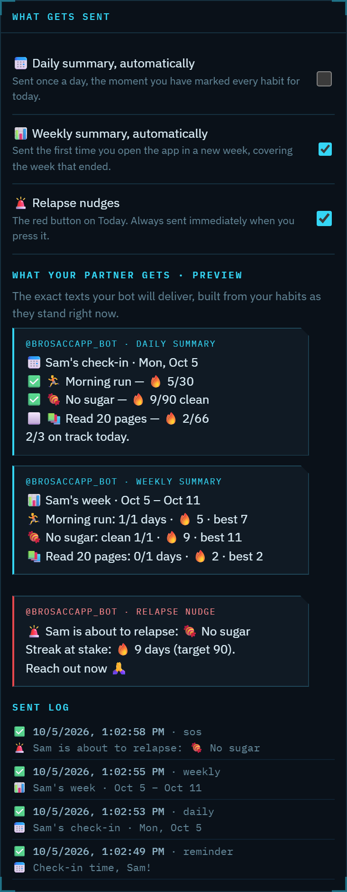 What your partner receives: the exact daily summary, weekly summary and relapse nudge, plus the sent log.</td><td width="50%" valign="top">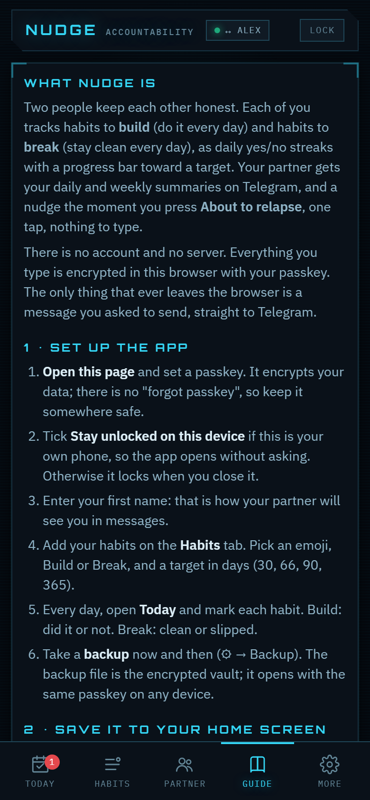 The Guide: set-up, Home Screen on iPhone / Android / desktop, creating the bots, troubleshooting, privacy.</td></tr>
<tr><td width="50%" valign="top"> More: week start, backup and restore of the encrypted vault, change passkey, lock, delete everything.</td><td width="50%" valign="top">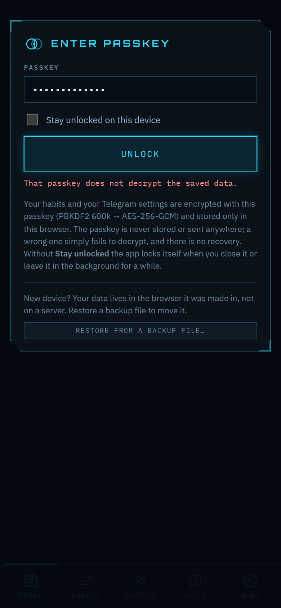 Locked: a wrong passkey simply fails to decrypt; there is no recovery and no server to ask.</td></tr>
<tr><td width="50%" valign="top">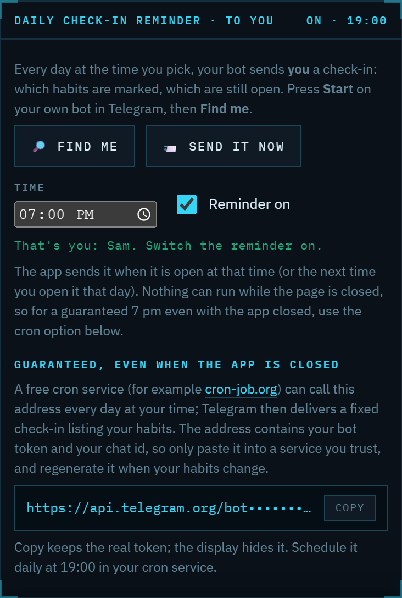 Daily check-in reminder to yourself: pick a time (7 pm by default), switch it on; the cron address gives a guaranteed delivery even with the app closed, token hidden on screen.</td><td width="50%" valign="top"></td></tr>
</table>

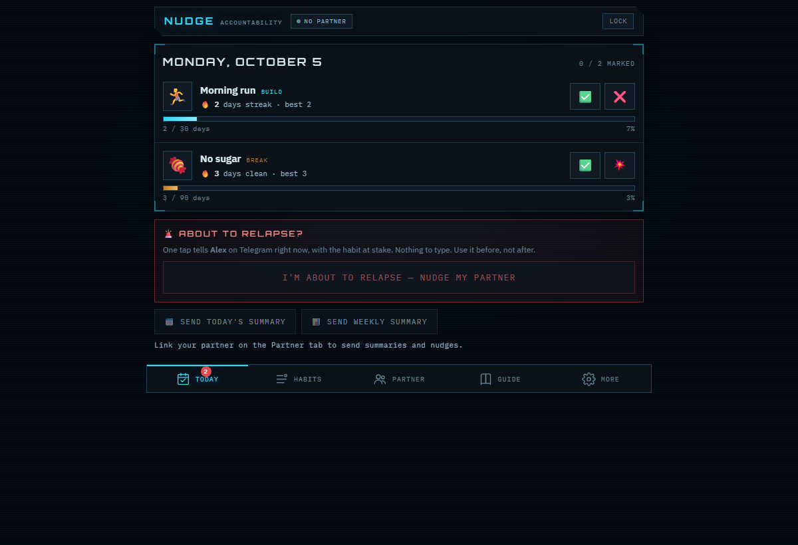
 On a desktop the same page centres itself, with the tabs along the top.

Taken in a headless browser with throwaway data: the names (Sam, Alex) and habits are made up, the
token field is never shown filled, and no chat ids appear. The bot and the three example messages
were real, delivered to a test chat.

## How it works

- **Habits.** Build or Break, an emoji, a target in days (21 / 30 / 66 / 90 / 365 or your own), a
  start date, and an optional "why" you will read on a hard day. Add, edit, delete at will. The
  two of you do not need the same habits; each app is its own.
- **Daily check-in.** On Today, each habit gets ✅ or ❌ (Build: did it / not today) or ✅ / 💥
  (Break: clean / slipped). Tap again to clear. The streak, best streak, and a progress bar
  (streak / target) update as you go.
- **Streak rules.** A Build habit counts a day only when you mark it done, and today stays open
  until you mark it. A Break habit counts a day clean unless you mark a slip. A miss or a slip
  resets the streak. The 12-week calendar in each habit lets you correct past days.
- **Telegram.** Each person creates their own bot with @BotFather and pastes the token into their
  own app. Your partner presses Start on your bot; **Find my partner** lists who has messaged the
  bot and you pick them; **Send a test** confirms delivery. Your app then sends, through your bot,
  to your partner's Telegram:
  - a **daily summary** once every habit is marked (automatic, or the button),
  - a **weekly summary** on your first visit in a new week (automatic, or the button),
  - a **relapse nudge** the moment you press the red button, with the habit at stake and its
    streak. Nothing to type: one habit sends on the spot, several means one tap on the one at stake.
- **Daily check-in reminder, to you.** Press Start on your own bot, **Find me**, pick a time (7 pm by
  default) and switch it on: your bot messages you what is marked and what is still open, with a link.
  A page can't run while closed, so this goes out when the app is open at that time or when you next
  open it that day. For a guaranteed time with the app closed, the app generates a cron address (bot
  token plus your chat id) to paste into a free scheduler such as cron-job.org.
  Tokens are never shared and nothing passes through a third server. You keep talking in your
  normal Telegram chat; the bots only deliver notifications. Both directions work the same way
  with the partner's own bot.
- **Lock.** Set a passkey on first visit. Tick **Stay unlocked on this device** on your own phone
  and the app opens without asking (the derived key, never the passkey, is kept as a
  non-extractable key in the browser). Otherwise the app locks when you close it or leave it in
  the background for five minutes, and **Lock** forgets the key at any time.
- **Backup.** The backup file is the encrypted vault; restore it on another device and unlock it
  with the same passkey. Clearing the browser's site data erases the vault, so take backups.

## Privacy model

- The vault is one AES-256-GCM blob in localStorage. The key is derived from your passkey with
  PBKDF2-HMAC-SHA256 (600,000 iterations, random salt) and never stored; a wrong passkey fails to
  decrypt. There is no recovery.
- The repository and the published page contain no user data and no secrets. Hosting on GitHub
  Pages serves exactly the files in this repo.
- Telegram sees the messages you send and nothing else. Calls go from your browser to
  `api.telegram.org` over HTTPS with your own bot's token; the Sent log on the Partner tab records
  each attempt and any error text Telegram returned.

## Running it yourself

It is a single `index.html` plus a manifest, a service worker (offline app shell) and icons. Open
the file, serve the folder statically, or fork the repo and turn on GitHub Pages. The service
worker registers only over HTTPS.

## Credits and licence

Code: MIT. Theme: the Batcomputer HUD. The vault pattern comes from Kryptonite Profile. Fonts from
Google Fonts (IBM Plex, Orbitron); the page still renders in system fonts offline.
